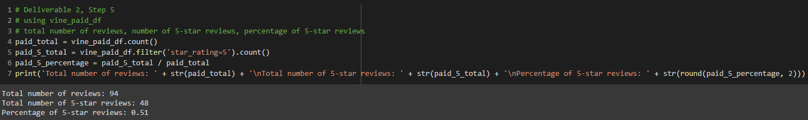
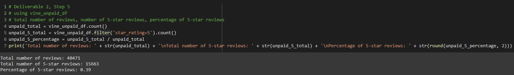

# Amazon-Vine-Analysis

## Challenge Overview
Use PySpark to perform the ETL process to extract the dataset, transform the data, connect to an AWS RDS instance, and load the transformed data into pgAdmin. Use PySpark to determine if there is any bias toward favorable reviews from Vine members in your dataset.

## Resources
- [Video_Games_Amazon_Review_Dataset](https://s3.amazonaws.com/amazon-reviews-pds/tsv/amazon_reviews_us_Video_Games_v1_00.tsv.gz)
- Software: Google Colaboratory, PostgreSQl 12.4, pgAdmin 4.24, Visual Studio Code 1.47.2, Amazon Web Services (AWS)

## Results

| **Vine Review Statstics** |
|:--------------------------------------:|
|  |
| **Non-Vine Review Statstics** |
|  |

- There were a total of **94** Vine reviews and **40471** non-Vine reviews.
- **48** of the Vine reviews were 5 stars. **15663** of the non-Vine reviews were 5-stars.
- The percentage of 5-star Vine reviews is **51%**. The percentage of 5-star non-Vine reviews is **39%**.

## Summary
There is a positivity bias for reviews in the Vine program. Looking at the percentages for Vine and non-Vine reviews, we can see that Vine reviews are more likely to be rated 5 stars. An additional analysis we can make is to check if the Vine reviews had any affect on helpful votes. Being in the Vine program might influence how people vote on the reviews.